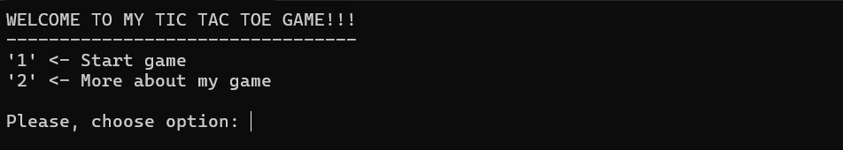
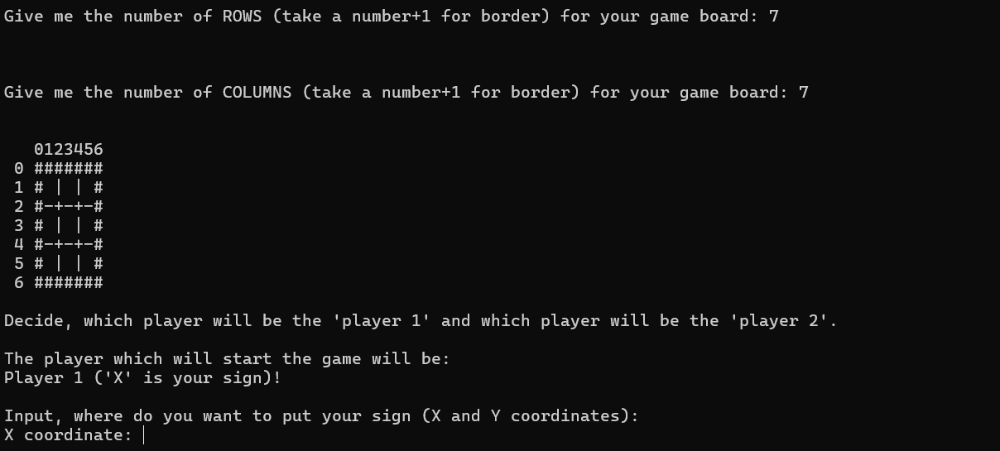
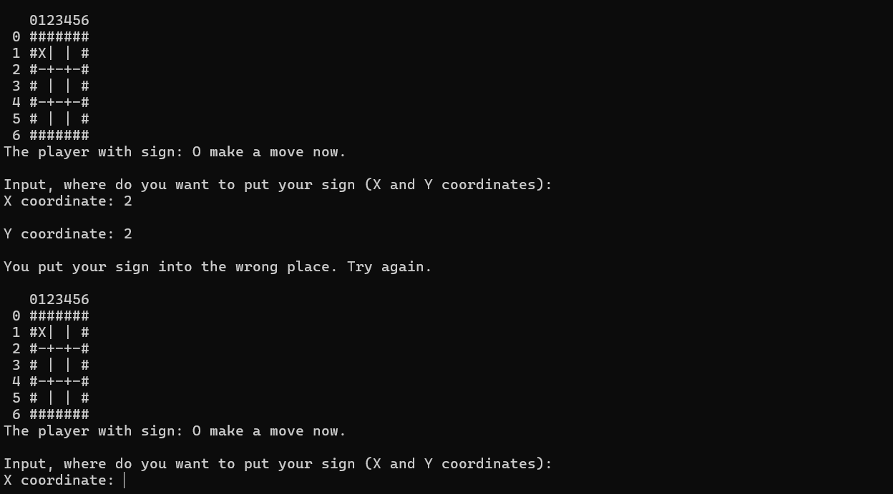
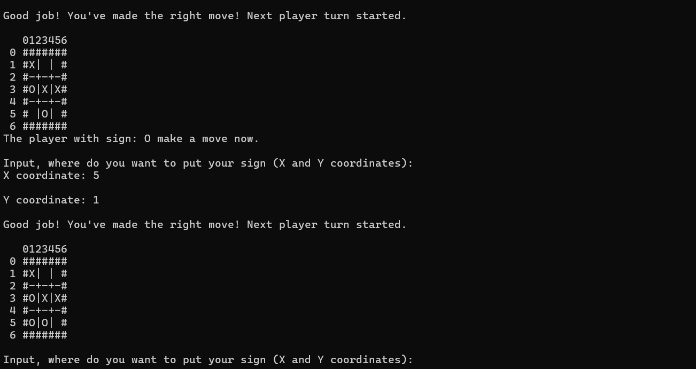
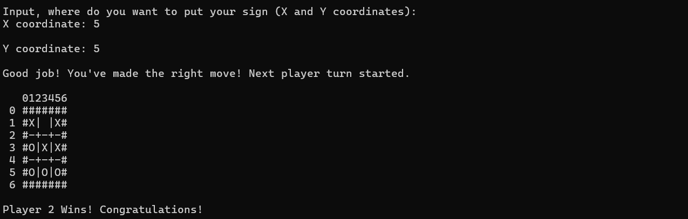

# KÓŁKO I KRZYŻYK 🟣✖️

Na tym repozytorium znajduje się mój prywatny projekt, którym jest prosta implementacja znanej całemu światu grze "Kółko i krzyżyk" napisane w języku C.
   Na ten moment zaimplementowana jest tylko wersja konsolowa (odpalana w terminalu) gry, ale kto wie, czy kiedyś nie pojawi się wersja okienkowa, dla lepszego "User expirence" 😉

## Jak uruchomić grę ?

Wystarczy ściągnąć folder z całą zawartością gry i odpalić ją w środowisku programistycznym "Visual Studio".
 Po uruchomieniu projektu powinno wyskoczyć proste okienko kosnolowe z początkowym menu gry.

## Zrzuty ekranu z działania aplikacji 📷

* Screen z początkowym stanem gry (tuż po odpaleniu projektu)
 

* Screeny z kilkoma krokami przebiegu gry
 
 
 

* Screen z rezultatem końcowym gry
 